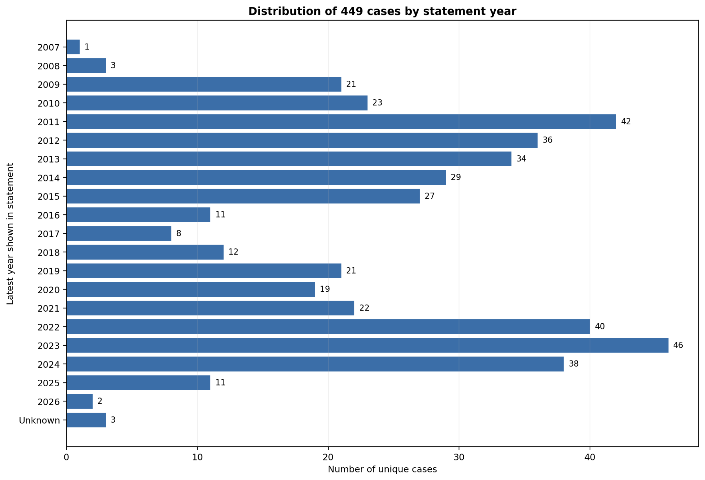
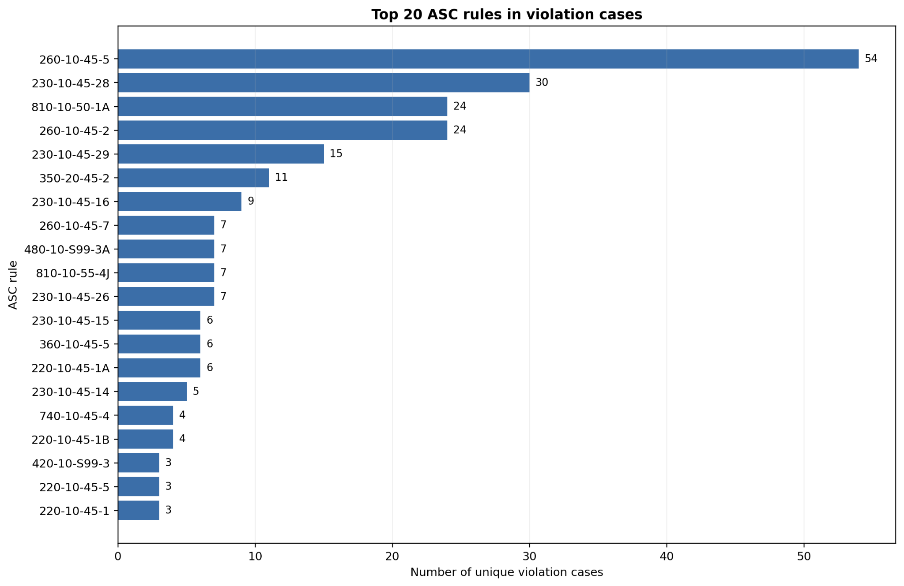

# ASC Table Compliance Benchmark

## Overview

This repository contains a real-world benchmark for evaluating whether a financial statement table complies with a specified Accounting Standards Codification (ASC) rule.

Each model input contains:

- an ASC rule ID;
- the corresponding FASB rule content; and
- a financial statement table extracted from an SEC filing.

The prediction target is a binary label: `VIOLATION` or `NO_VIOLATION`.

The current release contains **449 unique financial-statement cases**, represented as **524 flattened table–rule samples**. The flattened benchmark is strictly balanced, with **262 violation samples** and **262 non-violation samples**, and covers **61 unique ASC rules**. Each flattened sample evaluates exactly one financial statement table against one ASC rule.

## Dataset Files

The release contains two complementary versions:

```text
table_assessable_449_unflattened.csv
balanced_table_assessable_524_flattened.csv
```

| File | Description |
|---|---|
| `table_assessable_449_unflattened.csv` | Case-level version containing 449 unique financial-statement cases. A case may be associated with more than one ASC rule. |
| `balanced_table_assessable_524_flattened.csv` | Main benchmark containing 524 balanced table–rule samples. Each row contains exactly one rule and one binary label. |

The main flattened file includes the following fields:

| Column | Description |
|---|---|
| `sample_id` | Unique identifier for the flattened table–rule sample |
| `input` | ASC rule ID, complete FASB rule content, and financial statement table |
| `label` | Ground-truth label: `VIOLATION` or `NO_VIOLATION` |
| `pair_id` | Identifier linking a violation sample to its matched control |
| `original_sample_id` | Identifier of the corresponding unflattened financial-statement case |
| `original_pair_id` | Pair identifier inherited from the case-level dataset |
| `rule_id` | ASC rule evaluated in the sample |
| `rule_match_status` | Status indicating whether the rule content was successfully matched |
| `violation_scope` | Indicates that the decision is assessable from the financial statement table |

## Task

Given an ASC rule and its content together with a financial statement table, predict whether the table violates the specified rule:

```text
ASC rule ID + FASB rule content + financial statement table
    -> VIOLATION / NO_VIOLATION
```

The benchmark is intentionally flattened so that every prediction concerns one table–rule relationship, even when the original financial-statement case involves multiple ASC rules.

## Example

```text
ASC Rule:
230-10-45-28

FASB Rule Content:
<corresponding ASC requirement>

Financial Statement:
<financial statement table in Markdown>

Label:
VIOLATION
```

## Dataset Construction

Violation cases are derived from SEC comment-letter cases in Audit Analytics and linked to the corresponding SEC filings. The dataset retains cases for which the target ASC compliance issue can be assessed directly from a primary financial statement table without requiring additional note or footnote evidence.

Non-violation samples serve as matched controls for the same binary table–rule classification task. A `NO_VIOLATION` label means that the supplied table does not exhibit the target violation under the dataset's review criteria; it is not a general audit opinion on the complete filing.

Financial statement tables are extracted from SEC filings and converted to Markdown. Every retained flattened sample contains a non-empty table input and matched FASB rule content.

## Dataset Statistics

- **449** unique financial-statement cases
- **524** flattened table–rule samples
- **262** violation samples and **262** non-violation samples
- **61** unique ASC rules across the full benchmark
- **39** unique ASC rules represented among violation cases
- Financial-statement years primarily spanning **2007–2026**

### Distribution by Financial-Statement Year

The cases span multiple reporting periods, with the largest concentrations in 2011, 2022, 2023, and 2024. The year is defined as the latest reporting year identifiable directly from the financial statement section; three cases do not expose a reliable year in the extracted table.



### Most Frequently Violated ASC Rules

The violation subset covers 39 unique ASC rules. The most frequent rules are ASC 260-10-45-5, ASC 230-10-45-28, ASC 810-10-50-1A, and ASC 260-10-45-2, reflecting recurring presentation and classification issues involving earnings per share, cash flows, and noncontrolling interests.



## Loading the Dataset

```python
import pandas as pd

df = pd.read_csv(
    "balanced_table_assessable_524_flattened.csv",
    low_memory=False,
)

print(df.shape)
print(df["label"].value_counts())
print(df["rule_id"].nunique())

sample = df.iloc[0]
print(sample["input"])
print(sample["label"])
```

Expected dataset-level output:

```text
(524, ...)
VIOLATION       262
NO_VIOLATION    262
61
```

## Evaluation Notes

For standard evaluation, use the flattened 524-sample file. When creating train, validation, and test partitions, group samples by `original_pair_id` or, at minimum, by `original_sample_id`. This prevents samples derived from the same financial statement—or the corresponding matched pair—from appearing in different splits.

Recommended metrics include accuracy, balanced accuracy, macro F1, and class-specific precision, recall, and F1 scores.

## Citation

A formal citation will be added when the associated paper is released. Until then, please cite the repository URL and the dataset version or commit used in the experiment.
